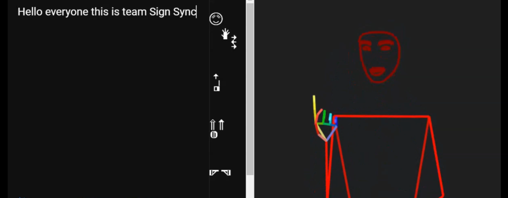
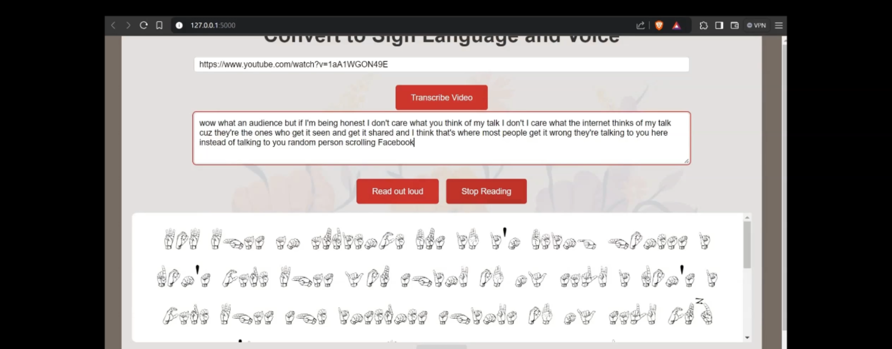

# SignSync

SignSync is a tool designed to facilitate the conversion of spoken language to sign language through 3D animation and letterwise conversion techniques. The project aims to bridge the communication gap between spoken language users and the Deaf or hard of hearing community.

## Table of Contents

- [Features](#features)
- [Installation](#installation)
- [Usage](#usage)
- [Contributing](#contributing)

## Features

- **3D Animation**: Converts spoken language to sign language using 3D animated models.
- **Letterwise Conversion**: Converts text to sign language alphabets.

## Installation

To get started with SignSync, follow these steps:

1. **Clone the repository**:
    ```bash
    git clone https://github.com/Anushkaghei/SignSync.git
    cd SignSync
    ```

2. **Navigate to the relevant folder**:
    - For 3D Animation:
      ```bash
      cd 3D-animation
      ```
    - For Letterwise Conversion:
      ```bash
      cd "Letterwise Conversion"
      ```
## Usage

### 3D Animation

Open PowerShell and execute the following commands:

Create a virtual environment to manage dependencies:

```powershell
python -m venv venv
.\venv\Scripts\activate
```

Install the package from the repository:

```powershell
pip install git+https://github.com/ZurichNLP/spoken-to-signed-translation.git
```

Download a specific lexicon using the following command:

```powershell
python -m spoken_to_signed.download_lexicon --name signsuisse --directory ./lexicons
```

Run a demo to test the translation from text to gloss to pose:

```powershell
python -m spoken_to_signed.text_to_gloss_to_pose --text "Kleine Kinder essen Pizza." --glosser simple --lexicon assets/dummy_lexicon --spoken-language de --signed-language sgg --pose quick_test.pose
```

### Detailed Commands for Each Script

Translate text to gloss:

```powershell
python -m spoken_to_signed.text_to_gloss --text "Kleine Kinder essen Pizza." --glosser simple --spoken-language de --signed-language sgg
```

Convert pose data to video format:

```powershell
python -m spoken_to_signed.pose_to_video --pose quick_test.pose --video quick_test.mp4
```

Translate text to gloss and then to pose:

```powershell
python -m spoken_to_signed.text_to_gloss_to_pose --text "Kleine Kinder essen Pizza." --glosser simple --lexicon assets/dummy_lexicon --spoken-language de --signed-language sgg --pose quick_test.pose
```

Translate text to gloss, convert to pose, and then to video:

```powershell
python -m spoken_to_signed.text_to_gloss_to_pose_to_video --text "Kleine Kinder essen Pizza." --glosser simple --lexicon assets/dummy_lexicon --spoken-language de --signed-language sgg --pose quick_test.pose --video quick_test.mp4
```




### Letterwise Conversion

1. Navigate to the `Letterwise Conversion` directory:
    ```bash
    cd "Letterwise Conversion"
    ```
2. Open the app in browser
 ```bash
  python run app.py
  ``` 
3. Visit the [Letterwise Conversion on Vercel](https://sign-sync.vercel.app/) to see the live application.



## Contributing

To contribute: 

1. Fork the repository.
2. Create a new branch (`git checkout -b feature-branch`).
3. Make your changes and commit them (`git commit -m 'Add new feature'`).
4. Push to the branch (`git push origin feature-branch`).
5. Create a Pull Request.
